# 🚀 Opération : Stock Maîtrisé - Le Guide du Quartier Général

## 🎯 Le Briefing de Mission

Bienvenue, Opérateur.

Vous êtes sur le point d'intégrer le **Système de Gestion de Stock et de Demandes**, la colonne vertébrale numérique de notre logistique. Développé en **PHP** et propulsé par **MySQL**, ce système n'est pas qu'une simple base de données ; c'est notre **Quartier Général** pour assurer que chaque ressource arrive à destination, au bon moment.

Votre mission est simple : maintenir la fluidité des opérations, de la demande initiale à la livraison finale. L'efficacité de toute l'organisation repose sur la précision de vos actions.

---

## 👤 Votre Rôle dans la Mission

Notre QG est structuré autour de trois rôles cruciaux. Identifiez le vôtre :

### 1. L'Agent (Le Demandeur)
*   **Accès :** Tableau de bord Agent (`agent_dashboard.html`)
*   **Mission :** Vous êtes le premier maillon. Votre rôle est d'identifier les besoins et de soumettre des requêtes précises. Le système vérifie instantanément si l'article est en stock avant de valider votre demande.
*   **Devise :** *« Demander avec précision, c'est garantir la mission. »*

### 2. Le Chef (Le Validateur)
*   **Accès :** Tableau de bord Chef (`chef_dashboard.php`)
*   **Mission :** Vous êtes le stratège. Toutes les demandes passent par votre bureau pour validation. Vous avez la vue d'ensemble et l'autorité pour donner le feu vert, assurant que les ressources sont allouées de manière optimale.
*   **Devise :** *« La validation est la clé de la bonne allocation. »*

### 3. Le Magasinier (Le Gardien du Stock)
*   **Accès :** Tableau de bord Magasinier (`magasinier_dashboard.html`)
*   **Mission :** Vous êtes le maître de l'entrepôt. Votre responsabilité est de maintenir l'inventaire à jour, de prélever les articles demandés et, surtout, de générer le **Bordereau de Livraison (PDF)**, la preuve finale de l'exécution de la mission.
*   **Devise :** *« Le stock est notre trésor, sa gestion, notre honneur. »*

---

## 🛠️ L'Arsenal Technologique

Voici les outils et capacités que vous avez à votre disposition :

| Capacité | Description de l'Opération | Composants Clés |
| :--- | :--- | :--- |
| **Identification Sécurisée** | Accès au QG via un portail de connexion avec sélection de rôle. | `login.php` |
| **Protocole de Demande** | Soumission rapide et vérification en temps réel de la disponibilité des articles. | `demande.php` |
| **Gestion des Flux** | Consultation et changement d'état des demandes (En attente, Validée, Rejetée). | `gestion_demandes.php`, `traiter_demande.php` |
| **Inventaire Central** | Ajout, consultation et mise à jour du stock d'articles. | `ajouter_stock.php`, `consulter_stock.php` |
| **Rapports d'Opération** | Génération de synthèses sur les mouvements de stock et l'historique des demandes. | `rapport_stock.php`, `historique_agents.php` |
| **Impression Tactique** | Utilisation de la librairie **FPDF** pour générer des bordereaux de livraison officiels. | `impression_bordereau.php`, `fpdf/` |

---

## 🖼️ Aperçu Visuel : Le Design du QG

L'interface utilisateur a été conçue pour être claire et fonctionnelle, en utilisant un design moderne et professionnel.

### 1. Portail de Connexion (Login)
*   **Style :** Design centré, fond clair (`#f4f4f9`), avec un conteneur de connexion blanc et ombré.
*   **Couleurs Clés :** La barre de navigation et le pied de page utilisent un bleu foncé (`#2c3e50`), tandis que les boutons d'action sont mis en évidence par un vert-bleu vif (`#18bc9c`).
*   **Champs :** Le formulaire requiert le Prénom, le Nom, le Mot de Passe et la sélection du Rôle (Agent, Chef, Magasinier).

### 2. Tableaux de Bord (Dashboards)
*   **Structure :** Tous les tableaux de bord (Agent, Chef, Magasinier) partagent une structure commune avec un en-tête de navigation et un pied de page.
*   **Navigation :** L'en-tête contient le logo de l'entreprise et des liens de navigation essentiels (Accueil, À propos, Contact, Déconnexion).
*   **Contenu :** Le contenu principal est centré et utilise des conteneurs clairs pour présenter les informations (listes d'articles, boutons d'action, tableaux de données). Par exemple, le tableau de bord de l'Agent présente des boutons d'action clairs pour choisir une catégorie (Bureautique, Informatique) et initier une demande.

---
### 📸(Screenshots)

<p align="center">
  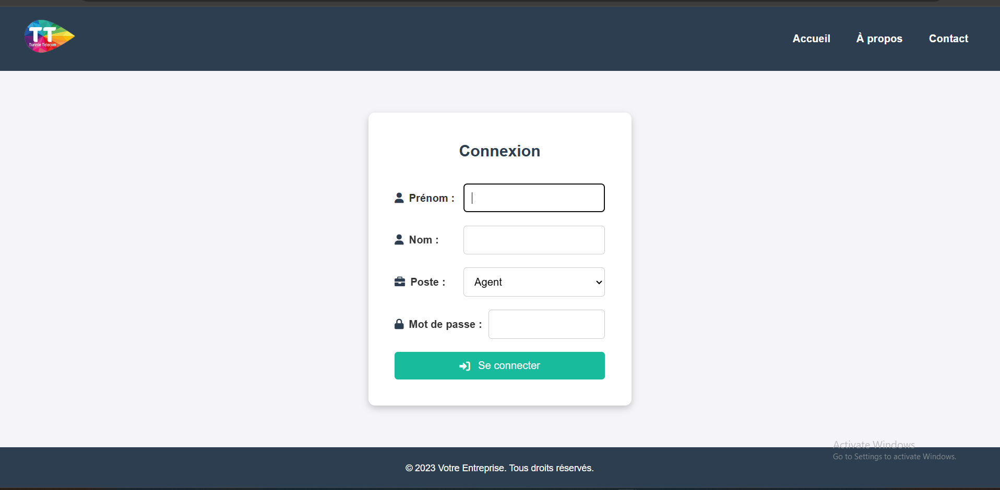
  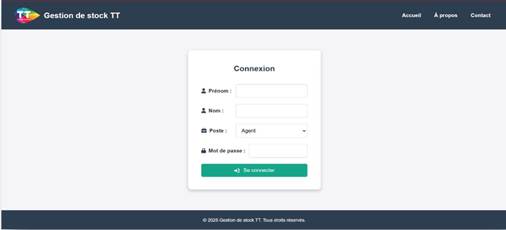
  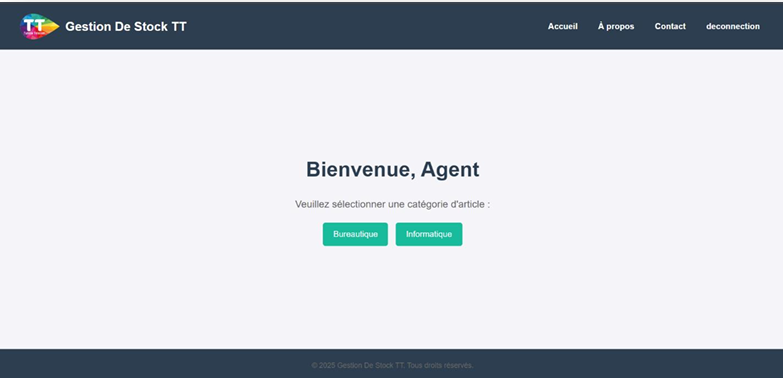
    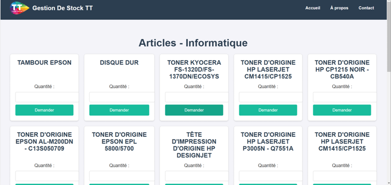
    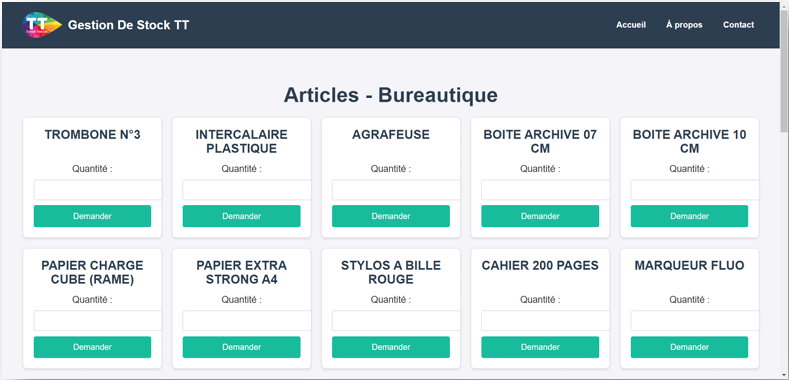
  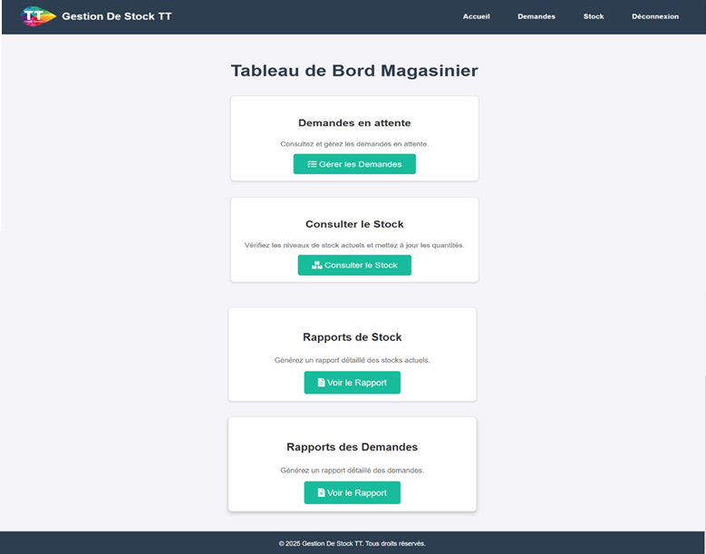
  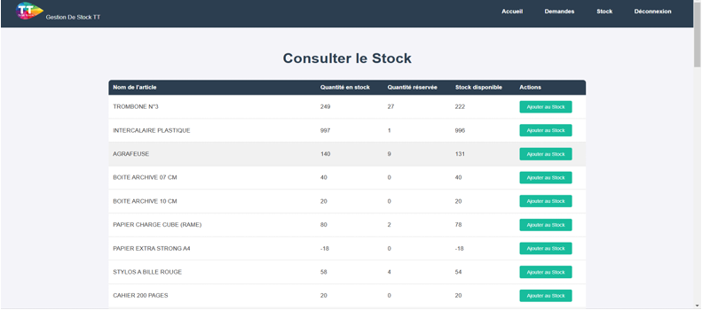
    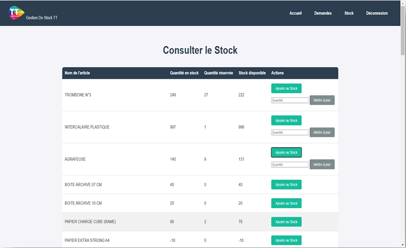
    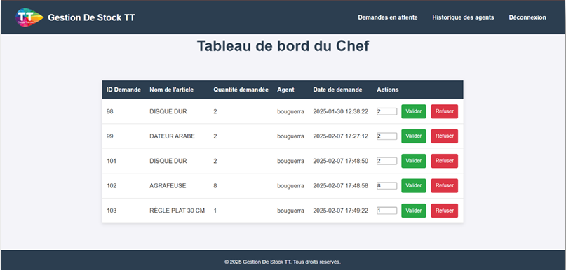
  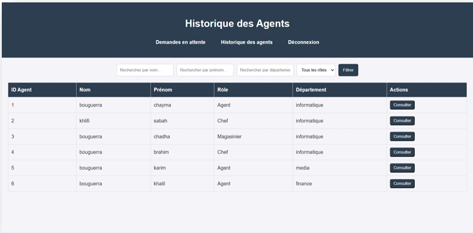
  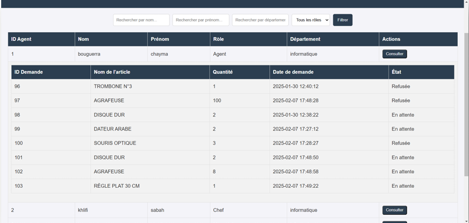
    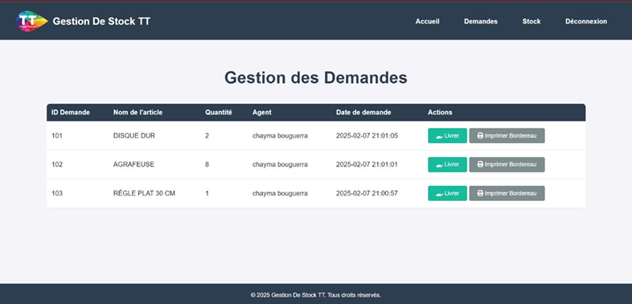
</p>


## ⚙️ Déploiement : Mise en Place du Quartier Général

Pour que le système soit opérationnel, suivez ces étapes de déploiement.

### 1. Prérequis Techniques

Assurez-vous que votre environnement de serveur est prêt. Nous recommandons une pile **XAMPP/WAMP/MAMP** :
*   Serveur Web (Apache)
*   PHP
*   Base de Données (MySQL/MariaDB)

### 2. Le Cœur du Système (Base de Données)

Le système est configuré pour se connecter à une base de données nommée `gestion_stock`.

1.  **Création :** Créez une base de données nommée `gestion_stock`.
2.  **Configuration :** Le fichier `config/db_connect.php` utilise les identifiants par défaut de développement (`root` sans mot de passe sur `localhost`). **Si vos identifiants sont différents, modifiez ce fichier immédiatement.**

```php
// config/db_connect.php
$host = 'localhost';
$user = 'root';
$password = ''; // À modifier si nécessaire
$database = 'gestion_stock';
// ...
